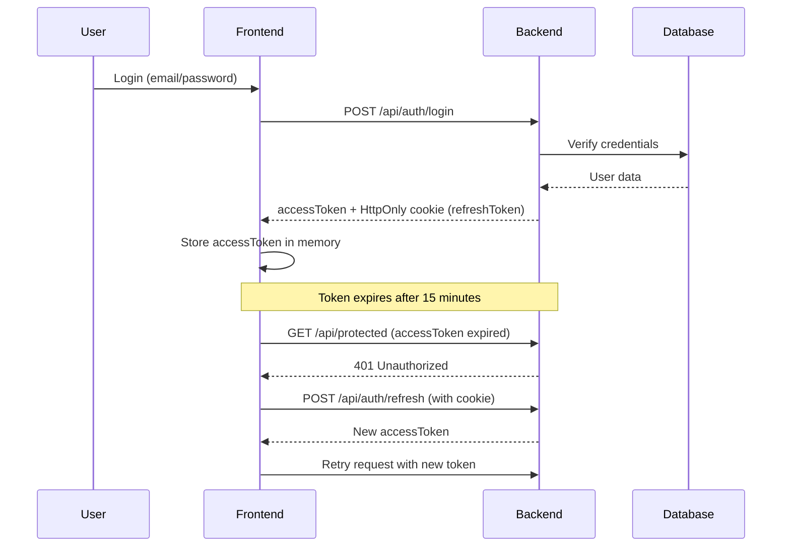

# 🔐 Auth Platform

> A full-stack authentication system built with FastAPI and React

A modern, production-ready authentication platform featuring secure token management, email verification, password recovery, and an admin dashboard.

---

## ✨ Features

### 🔑 Authentication
- **Email/Password Login** — Secure user authentication
- **Email Verification** — 4-digit code verification system
- **Token Management** — Refresh tokens in HttpOnly cookies, access tokens in memory
- **Password Recovery** — Complete forgot/reset password flow
- **Auto-refresh** — Seamless token renewal without user intervention

### 👨‍💼 Administration
- **User Management** — View and manage all registered users
- **Analytics Dashboard** — Visual signup trends with interactive charts
- **Role-based Access** — Admin allowlist and role-based permissions

---

## 🛠️ Tech Stack

### Backend
- **[FastAPI](https://fastapi.tiangolo.com/)** — Modern Python web framework
- **[SQLModel](https://sqlmodel.tiangolo.com/)** — SQL databases with Python type annotations
- **[Pydantic](https://docs.pydantic.dev/)** — Data validation using Python type hints
- **JWT** — Secure access and refresh token implementation
- **SMTP** — Email delivery for verification and password reset

### Frontend
- **[React](https://react.dev/)** — UI library
- **[Vite](https://vitejs.dev/)** — Next-generation frontend tooling
- **[TypeScript](https://www.typescriptlang.org/)** — Type-safe JavaScript
- **[TanStack Query](https://tanstack.com/query)** — Powerful data synchronization
- **[Zustand](https://zustand-demo.pmnd.rs/)** — Lightweight state management
- **[shadcn/ui](https://ui.shadcn.com/)** — Beautiful component library
- **[Recharts](https://recharts.org/)** — Composable charting library

---

## 📁 Project Structure

```
.
├── backend/
│   ├── app/
│   │   ├── main.py          # FastAPI app entry point
│   │   ├── config.py        # Environment configuration
│   │   ├── auth.py          # Authentication routes
│   │   ├── admin.py         # Admin routes & logic
│   │   ├── models.py        # Database models
│   │   ├── db.py            # Database connection
│   │   └── security.py      # JWT & security utilities
│   ├── requirements.txt
│   └── .env                 # Backend configuration
│
└── frontend/
    ├── src/
    │   ├── api/
    │   │   ├── auth.ts      # Auth API calls
    │   │   ├── admin.ts     # Admin API calls
    │   │   └── password.ts  # Password reset API
    │   ├── pages/
    │   │   ├── LoginPage.tsx
    │   │   ├── AdminDashboardPage.tsx
    │   │   └── ...
    │   └── ...
    ├── package.json
    └── .env                 # Frontend configuration
```

---

## 🚀 Getting Started

### Prerequisites

- **Python 3.8+**
- **Node.js 16+**
- **npm or yarn**

### 1️⃣ Backend Setup

#### Install Dependencies

```bash
cd backend

# Create virtual environment
python -m venv venv

# Activate virtual environment
# Windows
venv\Scripts\activate
# macOS/Linux
source venv/bin/activate

# Install packages
pip install -r requirements.txt
```

#### Configure Environment

Create `backend/.env`:

```env
# Database
DATABASE_URL=sqlite:///./app.db

# CORS
FRONTEND_ORIGIN=http://localhost:3000
COOKIE_SECURE=false

# JWT Configuration
JWT_SECRET=your-super-secret-key-change-this-in-production
ACCESS_TOKEN_EXPIRE_MINUTES=15
REFRESH_TOKEN_EXPIRE_DAYS=14

# Admin Access Control (JSON array format!)
ADMIN_EMAILS=["ludoludo2712@outlook.com"]

# SMTP Email Configuration
SMTP_HOST=smtp.gmail.com
SMTP_PORT=587
SMTP_USER=your-email@gmail.com
SMTP_PASSWORD=your-app-specific-password
FROM_EMAIL=noreply@yourapp.com

# Password Reset
FRONTEND_RESET_PASSWORD_URL=http://localhost:3000/reset-password
PASSWORD_RESET_EXPIRE_MINUTES=30
```

#### Run the Server

```bash
python -m uvicorn app.main:app --reload --host 127.0.0.1 --port 8000
```

**API Documentation:** http://127.0.0.1:8000/docs

### 2️⃣ Frontend Setup

#### Install Dependencies

```bash
cd frontend
npm install
```

#### Configure Environment

Create `frontend/.env`:

```env
VITE_API_BASE_URL=http://127.0.0.1:8000/api

# Optional: Frontend admin allowlist validation
# VITE_ADMIN_EMAILS=ludoludo2712@outlook.com
```

#### Run Development Server

```bash
npm run dev
```

**Application:** http://localhost:3000

---

## 🔄 Authentication Flow



### Key Points

- **Access Token**: Stored in memory (never in localStorage)
- **Refresh Token**: HttpOnly cookie (protected from XSS)
- **Auto-refresh**: Automatically renews tokens when expired
- **Session persistence**: Survives page refreshes via refresh token

---

## 👑 Admin Dashboard

### API Endpoints

| Method | Endpoint | Description |
|--------|----------|-------------|
| `GET` | `/api/admin/users` | List all users |
| `GET` | `/api/admin/stats/signups?days=30` | Get signup statistics |

### Access Control

Admins are authorized if **either** condition is met:

1. `user.role == "admin"` (database role)
2. `user.email` in `ADMIN_EMAILS` allowlist (recommended for development)

### Frontend Route

- **Admin Dashboard**: `/admin`

---

## ⚠️ Common Issues & Solutions

### 1. Admin Emails Parsing Error

**Problem**: Backend fails to parse `ADMIN_EMAILS`

**Solution**: Ensure it's valid JSON in `.env`

```env
✅ Correct:
ADMIN_EMAILS=["alice@example.com","bob@example.com"]

❌ Wrong:
ADMIN_EMAILS=alice@example.com,bob@example.com
```

### 2. 404 on `/api/admin/*` endpoints

**Problem**: Admin routes not found

**Solution**: Verify router is included in `main.py`:

```python
from app.admin import admin_router

app.include_router(admin_router)
```

### 3. Token Lost After Page Refresh

**Problem**: User logged out after refresh

**Explanation**: Access token is stored in memory only. The app automatically:
1. Detects missing access token
2. Calls `/api/auth/refresh` using the HttpOnly cookie
3. Obtains new access token
4. Re-fetches user data

**Solution**: Ensure your frontend implements auto-refresh logic properly.

### 4. SMTP Authentication Failed

**Problem**: Email sending fails

**Solutions**:
- For Gmail: Use [App Passwords](https://support.google.com/accounts/answer/185833)
- Enable "Less secure app access" (not recommended)
- Check SMTP credentials in `.env`

---

## 📜 Available Scripts

### Backend

```bash
# Development server with auto-reload
python -m uvicorn app.main:app --reload

# Production server
python -m uvicorn app.main:app --host 0.0.0.0 --port 8000
```

### Frontend

```bash
# Development server
npm run dev

# Production build
npm run build

# Preview production build
npm run preview

# Type checking
npm run type-check

# Linting
npm run lint
```

---

## 🔒 Security Best Practices

- ✅ Refresh tokens in HttpOnly cookies (XSS protection)
- ✅ Access tokens in memory only (no localStorage)
- ✅ CORS properly configured
- ✅ Password hashing (bcrypt/argon2)
- ✅ Email verification before full access
- ✅ Rate limiting on sensitive endpoints (recommended)
- ✅ HTTPS in production (`COOKIE_SECURE=true`)

---

## 🚢 Production Deployment Checklist

- [ ] Set `COOKIE_SECURE=true` in backend `.env`
- [ ] Generate strong `JWT_SECRET` (use `openssl rand -hex 32`)
- [ ] Use PostgreSQL instead of SQLite
- [ ] Configure production SMTP service
- [ ] Enable HTTPS/SSL certificates
- [ ] Set proper CORS origins
- [ ] Implement rate limiting
- [ ] Add logging and monitoring
- [ ] Set up database backups
- [ ] Review admin allowlist

---

## 📝 License

MIT License - feel free to use this project for personal or commercial purposes.

---

## 🤝 Contributing

Contributions, issues, and feature requests are welcome!

1. Fork the project
2. Create your feature branch (`git checkout -b feature/AmazingFeature`)
3. Commit your changes (`git commit -m 'Add some AmazingFeature'`)
4. Push to the branch (`git push origin feature/AmazingFeature`)
5. Open a Pull Request

---

## 📧 Support

For questions or issues:
- Open an issue on GitHub
- Email: ludoludo2712@outlook.com

---

<div align="center">
  Made with ❤️ using FastAPI and React
</div>